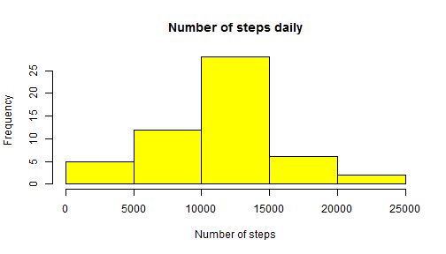
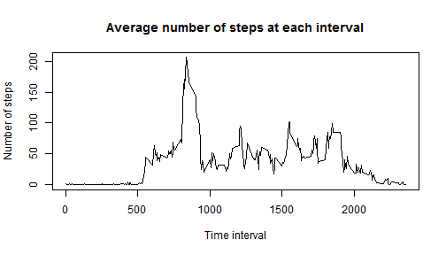
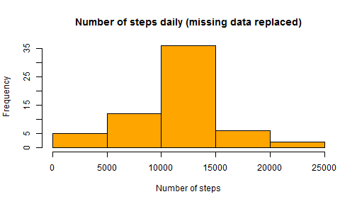
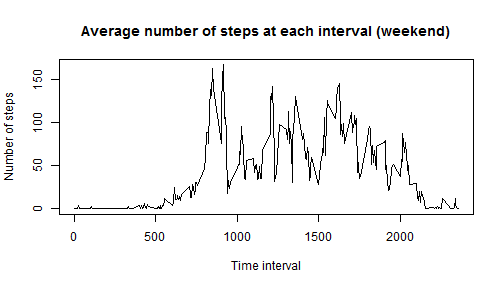
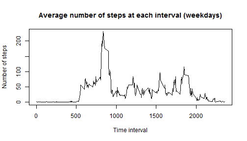

Activity Monitoring Data Analysis
========================================================

In the following document I analyze data obtained from a personal activity monitoring device. Firstly, I load the data and format date and time variables:


```r
activity <- read.csv("~/R/activity.csv")
activity$datetime <- strptime(paste(activity$date, sprintf("%04d", activity$interval), 
    sep = " "), "%Y-%m-%d %H%M")
```


Here I compute sum of steps for each day and present its distribution in a histogram:


```r
s <- split(activity, activity$date)
sum <- sapply(s, function(x) sum(x$steps))
histdata <- data.frame(names(sum), sum)
hist(histdata$sum, col = "yellow", main = "Number of steps daily", xlab = "Number of steps")
```

 


Average number of steps taken each day is equal to:


```r
mean(histdata$sum, na.rm = TRUE)
```

```
## [1] 10766
```


While its median is equal to:


```r
median(histdata$sum, na.rm = TRUE)
```

```
## [1] 10765
```


Here i present how the average daily activity pattern looks like.


```r
t <- split(activity, activity$interval)
avsteps <- sapply(t, function(x) mean(x$steps, na.rm = TRUE))
plot(levels(as.factor(activity$interval)), avsteps, type = "l", main = "Average number of steps at each interval", 
    xlab = "Time interval", ylab = "Number of steps")
```

 


The maximum average number of steps at given interval is equal to:


```r
max(avsteps)
```

```
## [1] 206.2
```


It is achieved at the interval:


```r
names(avsteps) <- NULL
levels(as.factor(activity$interval))[which(avsteps == max(avsteps))]
```

```
## [1] "835"
```


In the data set, there is a number of incomplete observations which is equal to:


```r
sum(is.na(activity))
```

```
## [1] 2304
```


What means that there is a following number of days missing from the data:


```r
sum(is.na(activity))/length(levels(as.factor(activity$interval)))
```

```
## [1] 8
```


For that reason I update the data set by replacing all missing values by the mean number of steps that correspons to given interval (new variable steps_new is introduced):


```r
avsteps_full <- rep(avsteps, times = length(levels(activity$date)))
steps <- activity$steps
ind <- which(steps %in% NA)
steps_new <- replace(steps, ind, avsteps_full)
```

```
## Warning: number of items to replace is not a multiple of replacement
## length
```

```r
activity$steps_new <- steps_new
```


Here is a histogram that depicts distribution of steps taken each day:


```r
s2 <- split(activity, activity$date)
sum2 <- sapply(s2, function(x) sum(x$steps_new))
histdata2 <- data.frame(names(sum2), sum2)
hist(histdata2$sum2, col = "orange", main = "Number of steps daily (missing data replaced)", 
    xlab = "Number of steps")
```

 


Average number of steps taken each day is in that case equal to:


```r
mean(histdata2$sum2)
```

```
## [1] 10766
```


While its median is now equal to:


```r
median(histdata2$sum2)
```

```
## [1] 10766
```


As we see above, computed values are roughly the same.

Here I introduce new variable that indicate whether given date is during weekend or working days and then make relevant subsets of the data:


```r
Sys.setlocale("LC_TIME", "English")
```

```
## [1] "English_United States.1252"
```

```r
activity$day <- as.factor(ifelse(weekdays(activity$datetime) == "Saturday" | 
    weekdays(activity$datetime) == "Sunday", c("weekend"), c("weekday")))
weekend <- activity[which(activity$day == "weekend"), ]
weekday <- activity[which(activity$day == "weekday"), ]
```


Having obtained subsetted data frames, now I present plots of activity patterns at weekends and weekdays:


```r
u_end <- split(weekend, as.factor(weekend$interval))
u_day <- split(weekday, as.factor(weekday$interval))
avs_end <- sapply(u_end, function(x) mean(x$steps_new))
avs_day <- sapply(u_day, function(x) mean(x$steps_new))
plot(levels(as.factor(weekend$interval)), avs_end, type = "l", main = "Average number of steps at each interval (weekend)", 
    xlab = "Time interval", ylab = "Number of steps")
```

 

```r
plot(levels(as.factor(weekday$interval)), avs_day, type = "l", main = "Average number of steps at each interval (weekdays)", 
    xlab = "Time interval", ylab = "Number of steps")
```

 


